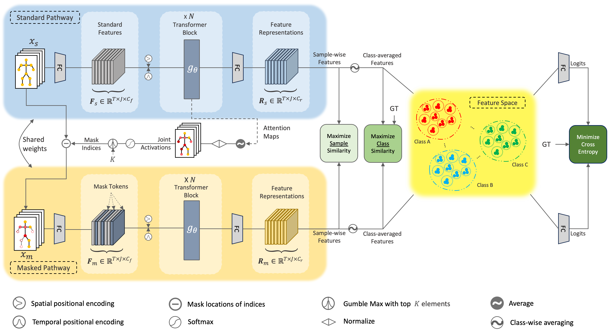

# MaskCLR: Multi-Level Contrastive Learning for Robust Skeletal Action Recognition


This is the official PyTorch implementation of the paper "MaskCLR: Multi-Level Contrastive Learning for Robust Skeletal Action Recognition"

<p align="center">

</p>

## Installation

```bash
conda create -n MaskCLR python=3.7 anaconda
conda activate MaskCLR
# Please install PyTorch according to your CUDA version.
conda install pytorch torchvision torchaudio pytorch-cuda=11.6 -c pytorch -c nvidia
pip install -r requirements.txt
```

## Data

The NTURGB+D 2D detection results are provided by [pyskl](https://github.com/kennymckormick/pyskl/blob/main/tools/data/README.md) using HRNet.

1. Download [`ntu60_hrnet.pkl`](https://download.openmmlab.com/mmaction/pyskl/data/nturgbd/ntu60_hrnet.pkl) and  [`ntu120_hrnet.pkl`](https://download.openmmlab.com/mmaction/pyskl/data/nturgbd/ntu120_hrnet.pkl) to  `data/action/`. 
2. Download the 1-shot split [here](https://1drv.ms/f/s!AvAdh0LSjEOlfi-hqlHxdVMZxWM) and put it to  `data/action/`. 

## Running

### NTURGB+D

**Train from scratch:**

```shell
# NTU60 Cross-subject
python train_maskclr.py \
--config configs/action/maskclr_train_NTU60_xsub.yaml \
--checkpoint checkpoint/action/maskclr_train_NTU60_xsub \
--print_freq 100 \
--msk_path_start_epoch 300

# NTU60 Cross-view
python train_maskclr.py \
--config configs/action/maskclr_train_NTU60_xview.yaml \
--checkpoint checkpoint/action/maskclr_train_NTU60_xview
--print_freq 100 \
--msk_path_start_epoch 300

# NTU120 Cross-subject
python train_maskclr.py \
--config configs/action/maskclr_train_NTU120_xsub.yaml \
--checkpoint checkpoint/action/maskclr_train_NTU120_xsub
--print_freq 100 \
--msk_path_start_epoch 300

# NTU120 Cross-setting
python train_maskclr.py \
--config configs/action/maskclr_train_NTU120_xset.yaml \
--checkpoint checkpoint/action/maskclr_train_NTU120_xset
--print_freq 100 \
--msk_path_start_epoch 300
```

**Evaluate:**

```bash
# Cross-subject
python train_maskclr.py \
--config configs/action/maskclr_train_NTU60_xsub.yaml \
--evaluate checkpoint/action/maskclr_train_NTU60_xsub/best_epoch.bin 

# Cross-view
python train_maskclr.py \
--config configs/action/maskclr_train_NTU60_xview.yaml \
--evaluate checkpoint/action/maskclr_train_NTU60_xview/best_epoch.bin 
```


> **Hints**
>
> 1. The model could handle different input lengths (no more than 243 frames). No need to explicitly specify the input length elsewhere.
> 2. The model uses 17 body keypoints ([H36M format](https://github.com/JimmySuen/integral-human-pose/blob/master/pytorch_projects/common_pytorch/dataset/hm36.py#L32)). If you are using other formats, please convert them before feeding to MaskCLR. 
> 3. For RGB videos, you need to extract 2D poses ([inference.md](docs/inference.md)), convert the keypoint format ([dataset_wild.py](lib/data/dataset_wild.py)), and then feed to MaskCLR.
>


## t-SNE Visualization

<p align="center">

</p>
